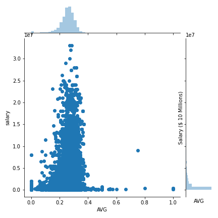
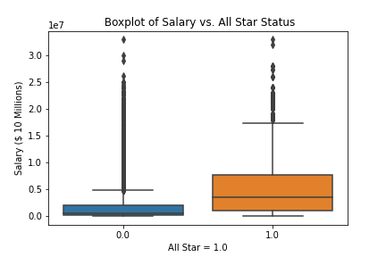
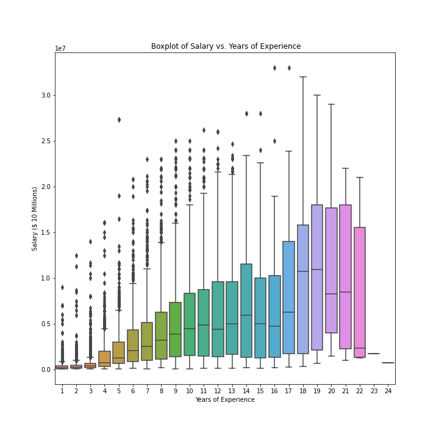
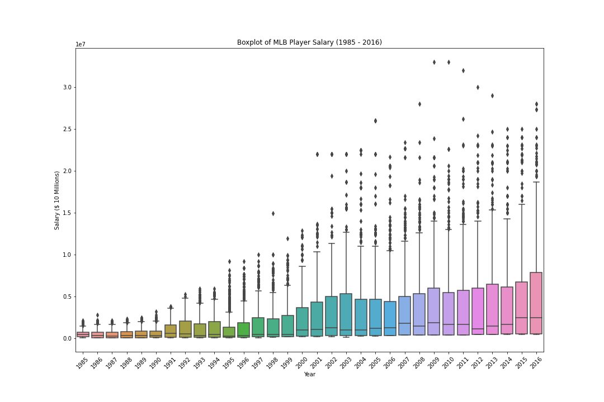
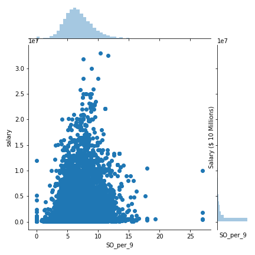
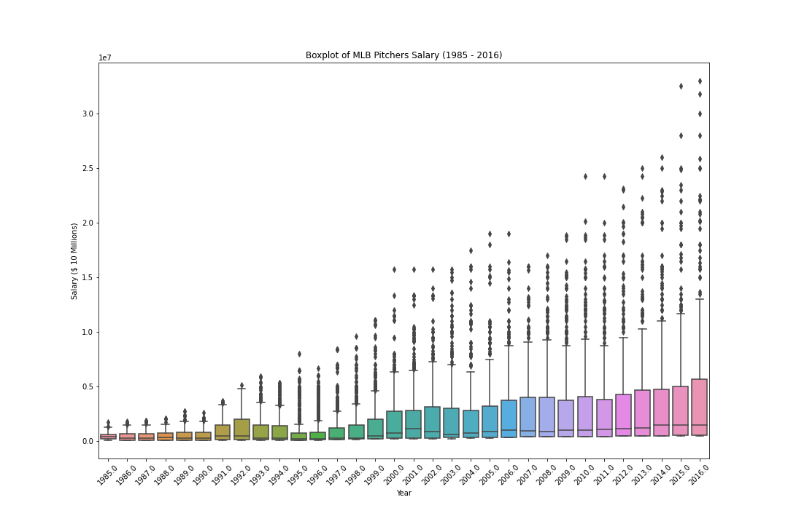
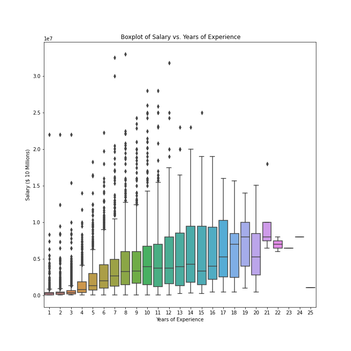
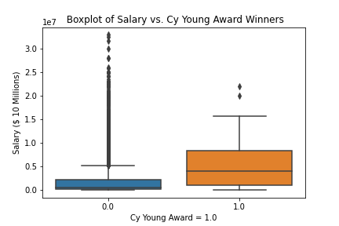

## Capstone Project: Predicting MLB Salary

### Problem Statement:

To build two regression models that can predict a player’s salary based on their on-field performance and their baseball statistics for a season.  Also, to build a user interactive web app with Streamlit where users can input custom baseball statistics to generate a salary prediction based on those statistics. One regression model will be used for position players only using hitting stats and the other model will be used for pitchers using pitching stats.

Here is the link to my app: https://share.streamlit.io/bhoskins23/capstone-project/main/MLB_salary.py

### Data:

The data used in this project came from Lahman’s Baseball Database on this website: http://www.seanlahman.com/baseball-archive/statistics/
I used 4 datasets from this database to help build my model:
- Batting dataset - Includes hitting stats for all players from 1871-2019.
- Pitching dataset - Includes pitching stats for all pitchers from 1871-2019.
- Salary dataset - Includes player salary for all players from 1985-2016.
- All-Star dataset - Includes data from MLB All Star Games from 1933-2019.
- Awards dataset - Includes data on award winners from 1877-2017.

Position Players Data Dictionary:

|Feature|Type|Dataset|Description|
|---|---|---|---|
|yearID|integer|pos_players|Year| 
|G|integer|pos_players|Games Played|
|AB|integer|pos_players|At-Bats|
|R|integer|pos_players|Runs|
|H|integer|pos_players|Hits|
|Doubles|integer|pos_players|Doubles|
|Triples|integer|pos_players|Triples|
|HR|integer|pos_players|Home Runs|
|RBI|integer|pos_players|Runs Batted In|
|SB|integer|pos_players|Stolen Bases|
|CS|integer|pos_players|Caught Stealing|
|BB|integer|pos_players|Walks|
|SO|integer|pos_players|Strikeouts|
|IBB|integer|pos_players|Intentional Walks|
|HBP|integer|pos_players|Hit by Pitch|
|SH|integer|pos_players|Sacrifice Hits|
|SF|integer|pos_players|Sacrifice Flies|
|GIDP|integer|pos_players|Grounded into Double Plays|
|Years_Exp|integer|pos_players|Years of Experience|
|allStar|integer|pos_players|0 = Not an All-Star, 1 = All-Star|
|awardID_ALCS_MVP|integer|pos_players|0 = Not an ALCS MVP, 1 = ALCS MVP|
|awardID_AllStar_Game_MVP|integer|pos_players|0 = Not an All-Star MVP, 1 = All-Star MVP|
|awardID_Babe_Ruth_Award|integer|pos_players|0 = Not a Babe Ruth Award winner , 1 = Babe Ruth Award winner|
|awardID_Gold_Glove|integer|pos_players|0 = Not a Gold Glove winner, 1 = Gold Glove Winner|
|awardID_Hank_Aaron_Award|integer|pos_players|0 = Not a Hank Aaron Award winner, 1 = Hank Aaron Award winner|
|awardID_Most_Valuable_Player|integer|pos_players|0 = Not a MVP, 1 = MVP winner|
|awardID_NLCS_MVP|integer|pos_players|0 = Not an NLCS MVP, 1 = NLCS MVP|
|awardID_Outstanding_DH_Award|integer|pos_players|0 = Not an Outstanding DH Award winner, 1 = Outstanding DH Award winner|
|awardID_Rookie_of_the_Year|integer|pos_players|0 = Not a Rookie of the Year winner, 1 = Rookie of the Year winner|
|awardID_Silver_Slugger|integer|pos_players|0 = Not a Silver Slugger Award Winner, 1 = Silver Slugger Award Winner|
|awardID_Triple_Crown|integer|pos_players|0 = Not a Triple Crown winner, 1 = Triple Crown Winner|
|awardID_World_Series_MVP|integer|pos_players|0 = Not a World Series MVP, 1 = World Series MVP|
|AVG|integer|pos_players|Batting Average|
|OBP|integer|pos_players|On Base Percentage|
|SLG|integer|pos_players|Slugging Percentage|
|OPS|integer|pos_players|On Base Plus Slugging|

Pitchers Data Dictionary:

|Feature|Type|Dataset|Description|
|---|---|---|---|
|yearID|integer|pitchers|Year| 
|W|integer|pitchers|Wins|
|L|integer|pitchers|Losses|
|G|integer|pitchers|Games Played|
|GS|integer|pitchers|Games Started|
|CG|integer|pitchers|Complete Games|
|SHO|integer|pitchers|Shutouts|
|SV|integer|pitchers|Saves|
|IPouts|integer|pitchers|Outs Recorded|
|H|integer|pitchers|Hits Allowed|
|ER|integer|pitchers|Earned Runs|
|HR|integer|pitchers|Home Runs Allowed|
|BB|integer|pitchers|Walks Allowed|
|SO|integer|pitchers|Stikeouts|
|BAOpp|integer|pitchers|Opponent Batting Average|
|ERA|integer|pitchers|Earned Run Average|
|IBB|integer|pitchers|Intentional Walks|
|WP|integer|pitchers|Wild Pithces|
|HBP|integer|pitchers|Hit by Pithces|
|Balks|integer|pitchers|Balks|
|BFP|integer|pitchers|Batters Faced|
|GF|integer|pitchers|Games Finished|
|R|integer|pitchers|Runs Allowed|
|SH|integer|pitchers|Sacrifice Hits Allowed|
|SF|integer|pitchers|Sacrifice Flies Allowed|
|GIDP|integer|pitchers|Double Plays Induced|
|Years_Exp|integer|pitchers|Years of Experience|
|allStar|integer|pitchers|0 = Not an All-Star, 1 = All-Star|
|awardID_ALCS_MVP|integer|pitchers|0 = Not an ALCS MVP, 1 = ALCS MVP|
|awardID_AllStar_Game_MVP|integer|pitchers|0 = Not an All-Star MVP, 1 = All-Star MVP|
|awardID_Gold_Glove|integer|pitchers|0 = Not a Gold Glove winner, 1 = Gold Glove Winner|
|awardID_Most_Valuable_Player|integer|pitchers|0 = Not a MVP, 1 = MVP winner|
|awardID_NLCS_MVP|integer|pitchers|0 = Not an NLCS MVP, 1 = NLCS MVP|
|awardID_Rookie_of_the_Year|integer|pitchers|0 = Not a Rookie of the Year winner, 1 = Rookie of the Year winner|
|awardID_World_Series_MVP|integer|pitchers|0 = Not a World Series MVP, 1 = World Series MVP|
|awardID_Cy_Young_Award|integer|pitchers|0 = Not a Cy Young Award Winner, 1 = Cy Young Award Winner|
|awardID_Rolaids_Relief_Man_Award|integer|pitchers|0 = Not a Rolaids Relief Man Award Winner, 1 = Rolaids Relief Man Award Winner|
|awardID_Pitching_Triple_Crown|integer|pitchers|0 = Not a Pitching Triple Crown winner, 1 = Pitching Triple Crown Winner|
|awardID_Reliever_of_the_Year_Award|integer|pitchers|0 = Not a Reliever of the Year Award Winner, 1 = Reliever of the Year Award Winner|
|WHIP|integer|pitchers|Walks and Hits per Innings Pitched|
|H_per_9|integer|pitchers|Hits Allowed per 9 innings pitched|
|HR_per_9|integer|pitchers|Home Runs Allowed per 9 innings pitched|
|BB_per_9|integer|pitchers|Walks Allowed per 9 innings pitched|
|SO_per_9|integer|pitchers|Strikeouts per 9 innings pitched|

### Methodology:

Data Cleaning For Position Players Data:

- Removed pitchers from the batting dataset. By merging the pitching dataset and batting dataset and removed players that showed up in both datasets.
- Dropped all rows that had stats before the 1985 season because I only had salary data from 1985 - 2016.  Then, merged the salary dataset to the batting dataset.
- Dropped players who made less than the minimum MLB salary in 1985 which was $60,000. Also, dropped players that did not record an at-bat in any season.
- Added a years of experience column. How many times a player showed up in the dataset equals how many seasons that player has been in the league.
- Added an All-Star column by merging the players that were on the all star dataset to my model dataset.  These players got a 1 if they were an All Star and missing values were imputed with 0 because that player was not an All Star. 
- For the Awards columns, I dummified the columns in the awards dataset, then selected the awards I wanted to include for the dataset.  Then, I merged the columns I wanted into my dataset.  If a player won an award they got a 1 and if they did not then it was 0.
- Batting Average (BA or AVG): the number of hits divided by at-bats
- On Base Percentage (OBP): a measure of how often a batter reaches base.
Formula: (Hits + Walks + Hit by Pitch) / (At Bats + Walks + Hit by Pitch + Sacrifice Flies)
- Slugging Percentage (SLG) : represents the total number of bases a player records per at bat.
Formula: (Hits + Doubles + (2 * Triples) + (3 * Home Runs) / At-Bats
- On Base Plus Slugging (OPS): Combines OBP and SLG to evaluate how often a player gets on base and if the player is more of a contact hitter or a power hitter.
Formula: OBP + SLG

Data Cleaning for Pitchers Data:

Same process as the Position Player dataset.

The only differences are:

- Taking out the position players from the pitching dataset.  To do this I scraped the position players pitching dataset from Baseball Reference using Beautiful Soup and merged this dataset to the pitchers dataset and took out the players that showed up on both datasets.
- Selected the awards from the awards dataset that pitchers can win.
- Walks and Hits Per Innings Pitched (WHIP): Shows how well a pitcher can keep hitters off the basepaths.
Formula: (Walks + Hits) / Innings Pitched
- Hits per 9 innings (H/9): The average number of hits a pitcher allows per nine innings pitched.
Formula: (9 * Hits) / Innings Pitched
- Home Runs per 9 innings (HR/9): The average number of home runs a pitcher allows per nine innings pitched.
Formula: (9 * Home Runs) / Innings Pitched
- Walks per 9 innings (BB/9): The average number of walks a pitcher allows per nine innings pitched.
Formula: (9 * Walks) / Innings Pitched
- Strike Outs per 9 innings (SO/9 or K/9): The average number of strike outs a pitcher gets per nine innings pitched.
Formula: (9 * Ks) / Innings Pitched

### EDA:

Most interesting graphs I found were:

### Data Preprocessing:

- Log transformed target column which was 'salary' for both position players and pitchers datasets.
- Also, tried Polynomial Features with Standard Scaler for feature engineering to build a better model than Linear Regression.
- Used gridsearch on boosting models to get the best scores for those models.

### Results:

Linear Regression Model For Position Players Results:

Training R^2 score = 0.71
Testing R^2 score = 0.72

Linear Regression Model For Pitchers Results:

Training R^2 score = 0.68
Testing R^2 score = 0.67

AdaBoost Model for Position Players Results:

Used GridSearch to find best parameters

Training R^2 score = 0.70
Testing R^2 score = 0.70

AdaBoost Model for Pitchers Results:

Used GridSearch to find best parameters

Training R^2 score = 0.66
Testing R^2 score = 0.66

Gradient Boosting Model for Position Players Results:

Used GridSearch to find best parameters

Training R^2 score = 0.83
Testing R^2 score = 0.84

Gradient Boosting Model for Pitchers Results:

Used GridSearch to find best parameters

Training R^2 score = 0.81
Testing R^2 score = 0.80

Lasso Regression Model for Position Players Results:

Used Polynomial Features and Standard Scaler on Features

Training R^2 score = 0.79
Testing R^2 score = 0.78

Lasso Regression Model for Pitchers Results:

Used Polynomial Features and Standard Scaler on Features

Training R^2 score = 0.76
Testing R^2 score = 0.74

Ridge Regression Model for Position Players Results:

Used Polynomial Features and Standard Scaler on Features

Training R^2 score = 0.80
Testing R^2 score = 0.78

Ridge Regression Model for Pitchers Results:

Used Polynomial Features and Standard Scaler on Features

Training R^2 score = 0.77
Testing R^2 score = 0.70

### Next Steps:

- The dataset used only had data from the 1985 season to the 2016 season. I would like to have more recent data and maybe data prior to 1985.  This might help the models generate better predictions.
- For features I would like to add an injury feature because the models did not factor that players could miss time because of injuries and cause them to not have the stats that we expect.
- I would like to upgrade the awards features for players that have won the award multiple times.
- I could also add even more advanced stats like WAR (Wins Above Replacement) to help the models have better scores.
- Another feature I would like to add is player positions such as shortstop and left field and fielding stats.
